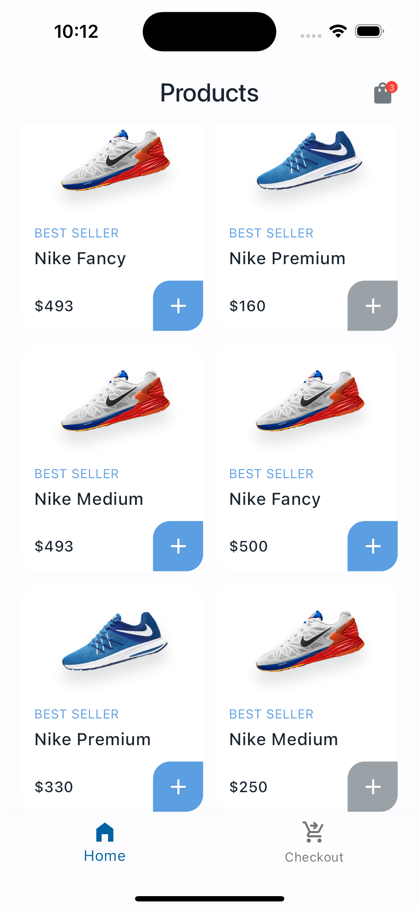
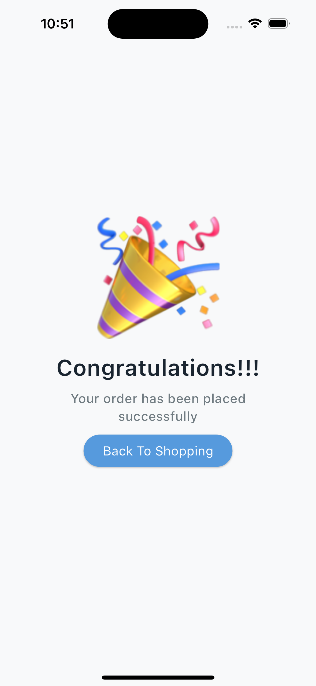

# ecommerce

A new Flutter project.

## Getting Started
Ecommerce Application
This project is a starting point for a Flutter application, the products are all dummy data.

**Font used**
|- AirbnbCereal: i choose this because of the fluidity it add to the user interface

it contains just 4 screens
|- Home screen which list the Products and also displays the cart length
    |- Cart Screen which contains the functionality of adding product ot cart

|- Checkout screen which contains the user information and also the order summary of the user
    |- Order Success screen which shows that the order has been placed successfully

## Cart functionality
**Here is how i handle state**
Flutter inbuilt Value notifier to manage state

|- Cart Class
    |- addToCart method which add a product to cart and calculate the product amount based on shipping fee

    |- incrementCartValue method which increment the cart count by one and also calculate the product amount based on the shipping fee also and count

    |- decrementCartValue method which decrement the cart count by one and also calculate the product amount based on the shipping fee too and count

    |- removeCartData method which removes the cart count by one and also calculate the product amount based on the shipping fee too and count

**Let's talk about the model classes**
|- Model Class
    |- ProductData model class which is a blueprint of the Product object using the new dart syntax within the fromJson
    |- CartData model class which is a blueprint of the Cart object using the new dart syntax within the fromJson

## Design Pattern
|- Singleton Pattern

## Screenshot

## Project Link
|- Github
    |- ["Github link"](https://github.com/genteel25/nikee_ecommerce)
|- Appetize.io
    |- ["Appetize project link"](https://appetize.io/app/tobyx3kxj3o2w7k5rmhth5o5ta?device=pixel7&osVersion=13.0)

**Quick Note**
NB: This project does not make use of any plugins or dependencies only those provided by Flutter framework
